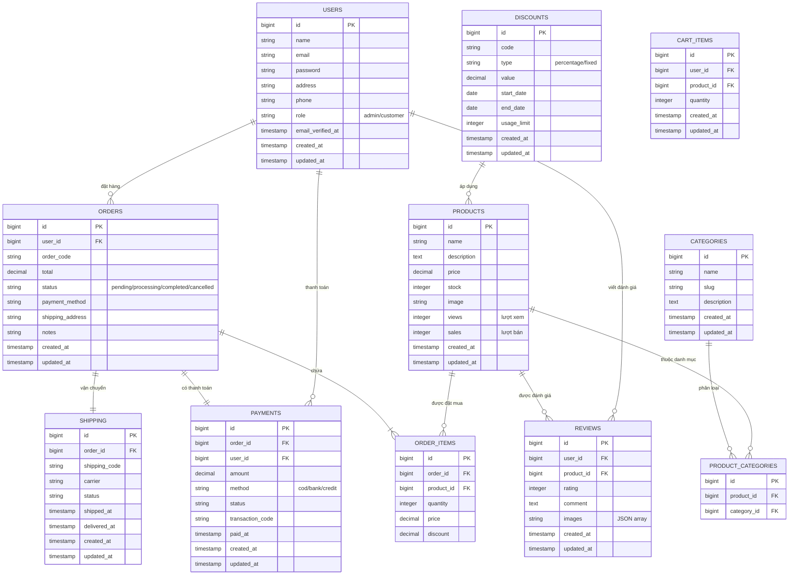
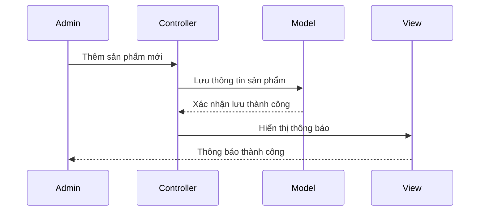
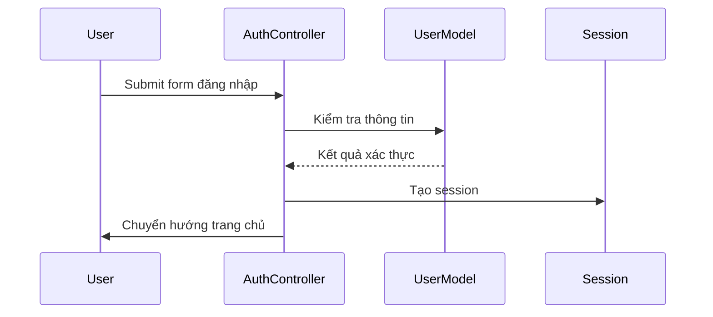
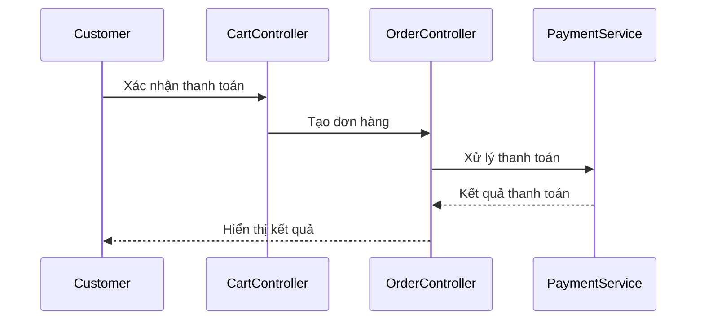
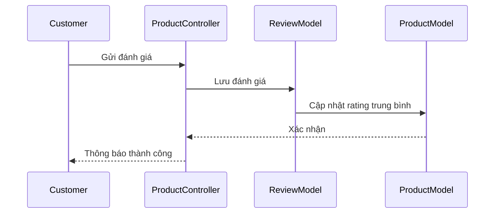
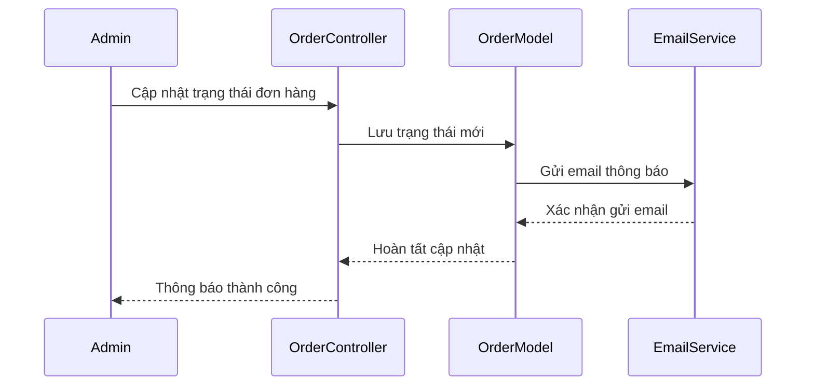

# 🌸 FlowerShop - Hệ thống Cửa hàng Hoa Trực tuyến

**Laravel Application Project**

**Họ và tên sinh viên:** Nguyễn Xuân Mạnh

**Mã Sinh viên:** 23010045

**Tên đề tài:** FlowerShop

## 📋 Mô tả dự án

Dự án "FlowerShop" là một ứng dụng web thương mại điện tử chuyên về kinh doanh hoa, cho phép khách hàng mua sắm hoa trực tuyến và quản trị viên quản lý sản phẩm, đơn hàng. Ứng dụng này cung cấp các tính năng như đăng ký, đăng nhập, quản lý sản phẩm, giỏ hàng, đặt hàng, thanh toán và xem lịch sử mua hàng.

**Công nghệ sử dụng:**
- Use Laravel Framework
- Use Breeze for authentication
- Use Eloquent ORM for database operations
- Use MySQL for database

## 📋 Mục lục

- [Mô tả dự án](#-mô-tả-dự-án)
- [Tính năng chính](#-tính-năng-chính)
- [Công nghệ sử dụng](#-công-nghệ-sử-dụng)
- [Yêu cầu hệ thống](#-yêu-cầu-hệ-thống)
- [Hướng dẫn cài đặt](#-hướng-dẫn-cài-đặt)
- [Cấu trúc dự án](#-cấu-trúc-dự-án)
- [Sử dụng](#-sử-dụng)
- [API Endpoints chính](#-api-endpoints-chính)
- [Testing](#-testing)
- [Tính năng nâng cao](#-tính-năng-nâng-cao)
- [Đóng góp](#-đóng-góp)
- [Ghi chú phát triển](#-ghi-chú-phát-triển)


## ✨ Tính năng chính

### 👥 Dành cho Khách hàng:
- **Xác thực người dùng**: Đăng ký, đăng nhập, đăng xuất
- **Duyệt sản phẩm**: Xem danh sách hoa với hình ảnh và thông tin chi tiết
- **Chi tiết sản phẩm**: Xem thông tin đầy đủ về từng loại hoa
- **Hệ thống đánh giá**:
  - Đánh giá và nhận xét sản phẩm
  - Xem đánh giá từ khách hàng khác
  - Hệ thống rating sao
- **Giỏ hàng thông minh**:
  - Thêm/xóa/cập nhật số lượng sản phẩm
  - Mua ngay sản phẩm
  - Thanh toán các sản phẩm đã chọn
- **Quản lý đơn hàng**:
  - Đặt hàng và thanh toán
  - Xem lịch sử mua hàng
  - Hủy đơn hàng
  - Nhiều phương thức thanh toán (COD, Chuyển khoản)
- **Quản lý hồ sơ**:
  - Cập nhật thông tin cá nhân và mật khẩu
  - Upload avatar cá nhân
  - Quản lý thông tin ngân hàng

### 🔧 Dành cho Quản trị viên:
- **Quản lý sản phẩm**: Thêm, sửa, xóa, xem danh sách sản phẩm
- **Quản lý đơn hàng**:
  - Xem và cập nhật trạng thái đơn hàng
  - Quản lý phương thức thanh toán
  - Xem thông tin ngân hàng khách hàng
- **Quản lý khách hàng**: Xem thông tin và lịch sử mua hàng của khách hàng
- **Quản lý đánh giá**: Kiểm duyệt và quản lý đánh giá sản phẩm
- **Dashboard**: Theo dõi hoạt động kinh doanh và thống kê

## 🛠 Công nghệ sử dụng

### Backend:
- **PHP**: ^8.2
- **Laravel Framework**: ^12.0
- **Laravel Breeze**: ^2.3 (Authentication)
- **Laravel Tinker**: ^2.10.1 (Interactive Shell)

### Frontend:
- **Blade Template Engine** (Laravel)
- **TailwindCSS**: ^4.0.0 (CSS Framework)
- **Vite**: ^6.2.4 (Build Tool)
- **Axios**: ^1.8.2 (HTTP Client)

### Database:
- **MySQL** (hoặc PostgreSQL/SQLite)
- **Eloquent ORM** (Laravel)

### Development Tools:
- **Composer** (PHP Dependency Manager)
- **NPM** (Node Package Manager)
- **Laravel Pint**: ^1.13 (Code Style)
- **PHPUnit**: ^11.5.3 (Testing)
- **Faker**: ^1.23 (Test Data)

## 📋 Yêu cầu hệ thống

- **PHP**: >= 8.2
- **Composer**: >= 2.0
- **Node.js**: >= 18.0
- **NPM**: >= 9.0
- **MySQL**: >= 8.0 (hoặc PostgreSQL >= 13.0)
- **Web Server**: Apache/Nginx

## 🚀 Hướng dẫn cài đặt

### 1. Clone dự án
```bash
git clone https://github.com/your-username/flowershop.git
cd flowershop
```

### 2. Cài đặt dependencies PHP
```bash
composer install
```

### 3. Cài đặt dependencies JavaScript
```bash
npm install
```

### 4. Cấu hình môi trường
```bash
# Sao chép file cấu hình
cp .env.example .env

# Tạo application key
php artisan key:generate
```

### 5. Cấu hình database trong file `.env`
```env
DB_CONNECTION=mysql
DB_HOST=127.0.0.1
DB_PORT=3306
DB_DATABASE=flowershop
DB_USERNAME=your_username
DB_PASSWORD=your_password
```

### 6. Chạy migration và seeder
```bash
# Tạo bảng database
php artisan migrate

# Tạo dữ liệu mẫu (optional)
php artisan db:seed

# Tạo storage link cho hình ảnh
php artisan storage:link
```

### 7. Khởi chạy ứng dụng

#### Phương pháp 1: Chạy riêng lẻ
```bash
# Terminal 1: Laravel server
php artisan serve

# Terminal 2: Vite dev server
npm run dev
```

#### Phương pháp 2: Chạy đồng thời (Khuyến nghị)
```bash
composer dev
```

Ứng dụng sẽ chạy tại: `http://localhost:8000`

## 📁 Cấu trúc dự án

```
flowershop/
├── app/
│   ├── Http/Controllers/          # Controllers xử lý logic
│   │   ├── AuthController.php     # Xác thực người dùng
│   │   ├── CartController.php     # Quản lý giỏ hàng
│   │   ├── CheckoutController.php # Xử lý thanh toán
│   │   ├── CustomerController.php # Quản lý khách hàng
│   │   ├── OrderController.php    # Quản lý đơn hàng
│   │   ├── ProductController.php  # Quản lý sản phẩm
│   │   └── ProfileController.php  # Quản lý hồ sơ
│   └── Models/                    # Models dữ liệu
│       ├── Customer.php
│       ├── Order.php
│       ├── OrderItem.php
│       ├── Product.php
│       ├── Review.php
│       └── User.php
├── database/
│   ├── migrations/                # Database migrations
│   └── seeders/                   # Database seeders
├── public/
│   └── images/
│       ├── products/              # Hình ảnh sản phẩm
│       └── avatars/               # Avatar người dùng
├── resources/
│   ├── css/                       # CSS files
│   ├── js/                        # JavaScript files
│   └── views/                     # Blade templates
│       ├── auth/                  # Trang xác thực
│       ├── cart/                  # Trang giỏ hàng
│       ├── customers/             # Trang khách hàng
│       ├── orders/                # Trang đơn hàng
│       ├── products/              # Trang sản phẩm
│       └── profile/               # Trang hồ sơ cá nhân
└── routes/
    └── web.php                    # Định tuyến web
```

## 🎯 Sử dụng

### Đăng nhập Admin
1. Chạy seeder để tạo tài khoản admin:
```bash
php artisan db:seed --class=AdminUserSeeder
```

2. Đăng nhập với thông tin admin mặc định hoặc tạo tài khoản admin mới

### Quản lý sản phẩm
- Truy cập `/products` để xem danh sách sản phẩm
- Thêm sản phẩm mới với hình ảnh tại `/products/create`
- Chỉnh sửa sản phẩm tại `/products/{id}/edit`

### Mua sắm
- Khách hàng có thể duyệt sản phẩm tại `/shop`
- Thêm sản phẩm vào giỏ hàng từ trang chi tiết sản phẩm
- Thanh toán tại `/checkout`

## 🔗 API Endpoints chính

### Authentication
- `GET /login` - Trang đăng nhập
- `POST /login` - Xử lý đăng nhập
- `GET /register` - Trang đăng ký
- `POST /register` - Xử lý đăng ký
- `POST /logout` - Đăng xuất

### Products
- `GET /shop` - Danh sách sản phẩm (shop)
- `GET /products` - Quản lý sản phẩm (admin)
- `GET /products/create` - Tạo sản phẩm mới
- `GET /products/{id}` - Chi tiết sản phẩm
- `POST /products` - Lưu sản phẩm mới
- `PUT /products/{id}` - Cập nhật sản phẩm
- `DELETE /products/{id}` - Xóa sản phẩm

### Cart & Checkout
- `GET /cart` - Xem giỏ hàng
- `POST /cart/add/{id}` - Thêm vào giỏ hàng
- `POST /cart/update/{id}` - Cập nhật giỏ hàng
- `POST /cart/remove/{id}` - Xóa khỏi giỏ hàng
- `POST /cart/buy-now/{id}` - Mua ngay
- `GET /checkout` - Trang thanh toán
- `POST /checkout` - Xử lý thanh toán

### Orders
- `GET /orders` - Danh sách đơn hàng (admin)
- `GET /orders/history` - Lịch sử mua hàng (customer)
- `POST /orders/{id}/cancel` - Hủy đơn hàng
- `POST /orders/{id}/update-status` - Cập nhật trạng thái (admin)

### Reviews
- `POST /products/{id}/reviews` - Thêm đánh giá sản phẩm
- `GET /products/{id}/reviews` - Xem đánh giá sản phẩm
- `DELETE /reviews/{id}` - Xóa đánh giá (admin/owner)

### Profile
- `GET /profile` - Trang hồ sơ cá nhân
- `POST /profile/update` - Cập nhật thông tin cá nhân
- `POST /profile/avatar` - Cập nhật avatar

## 🧪 Testing

Chạy test suite:
```bash
# Chạy tất cả tests
composer test

# Hoặc sử dụng PHPUnit trực tiếp
php artisan test
```

## 📈 Tính năng nâng cao

- **Session-based Cart**: Giỏ hàng lưu trữ trong session
- **Image Upload**: Upload và quản lý hình ảnh sản phẩm, avatar người dùng
- **Order Management**: Hệ thống quản lý đơn hàng với các trạng thái
- **Payment Integration**:
  - Thanh toán COD (Cash on Delivery)
  - Chuyển khoản ngân hàng
  - Lưu thông tin ngân hàng khách hàng
- **Review System**:
  - Hệ thống đánh giá sao (1-5 sao)
  - Bình luận và nhận xét chi tiết
  - Kiểm duyệt đánh giá
- **User Profile**:
  - Quản lý thông tin cá nhân và đổi mật khẩu
  - Upload và quản lý avatar
  - Lưu thông tin ngân hàng
- **Responsive Design**: Giao diện tương thích đa thiết bị
- **Admin Analytics**: Thống kê sản phẩm, đơn hàng và khách hàng


## 🤝 Đóng góp

1. Fork dự án
2. Tạo feature branch (`git checkout -b feature/amazing-feature`)
3. Commit thay đổi (`git commit -m 'Add some amazing feature'`)
4. Push to branch (`git push origin feature/amazing-feature`)
5. Tạo Pull Request

## 📝 Ghi chú phát triển

### Lệnh hữu ích
```bash
# Tạo controller mới
php artisan make:controller ControllerName

# Tạo model mới
php artisan make:model ModelName -m

# Tạo migration mới
php artisan make:migration create_table_name

# Xem routes
php artisan route:list

# Xóa cache
php artisan cache:clear
php artisan config:clear
php artisan view:clear
```

### Cấu trúc database chính
- `users` - Thông tin người dùng và admin (có avatar)
- `customers` - Thông tin khách hàng
- `products` - Danh sách sản phẩm hoa
- `orders` - Đơn hàng (có payment_method và thông tin ngân hàng)
- `order_items` - Chi tiết đơn hàng
- `reviews` - Đánh giá và nhận xét sản phẩm


### Phương thức thanh toán hỗ trợ
- **COD**: Thanh toán khi nhận hàng
- **Bank Transfer**: Chuyển khoản ngân hàng
  - Hỗ trợ lưu thông tin tài khoản khách hàng
  - Tên chủ tài khoản, số tài khoản, tên ngân hàng

### Tính năng bảo mật
- **Authentication**: Laravel Breeze với session-based auth
- **File Upload Security**: Validation hình ảnh và giới hạn dung lượng
- **Data Validation**: Comprehensive input validation
- **CSRF Protection**: Laravel built-in CSRF protection

### Sơ đồ Database (ERD)




## Quy trình hệ thống (Sequence Diagrams)

### 1. Quản lý sản phẩm


### 2. Quy trình đăng nhập


### 3. Quy trình thanh toán


### 4. Quy trình đánh giá sản phẩm


### 5. Quy trình quản lý đơn hàng

---
