# 🌸 FlowerShop - Hệ thống Cửa hàng Hoa Trực tuyến

**Laravel Application Project**

**Họ và tên sinh viên:** Nguyễn Xuân Mạnh

**Mã Sinh viên:** 23010045

**Tên đề tài:** FlowerShop

## 📋 Mô tả dự án

Dự án "FlowerShop" là một ứng dụng web thương mại điện tử chuyên về kinh doanh hoa, cho phép khách hàng mua sắm hoa trực tuyến và quản trị viên quản lý sản phẩm, đơn hàng. Ứng dụng này cung cấp các tính năng như đăng ký, đăng nhập, quản lý sản phẩm, giỏ hàng, đặt hàng, thanh toán và xem lịch sử mua hàng.

**Công nghệ sử dụng:**
- Use Laravel Framework
- Use Breeze for authentication
- Use Eloquent ORM for database operations
- Use MySQL for database

## 📋 Mục lục

- [Mô tả dự án](#-mô-tả-dự-án)
- [Tính năng chính](#-tính-năng-chính)
  - [Dành cho Khách hàng](#-dành-cho-khách-hàng)
  - [Dành cho Quản trị viên](#-dành-cho-quản-trị-viên)
- [Công nghệ sử dụng](#-công-nghệ-sử-dụng)
  - [Backend](#backend)
  - [Frontend](#frontend)
  - [Database](#database)
  - [Development Tools](#development-tools)
- [Yêu cầu hệ thống](#-yêu-cầu-hệ-thống)
- [Hướng dẫn cài đặt](#-hướng-dẫn-cài-đặt)
  - [Clone dự án](#1-clone-dự-án)
  - [Cài đặt dependencies PHP](#2-cài-đặt-dependencies-php)
  - [Cài đặt dependencies JavaScript](#3-cài-đặt-dependencies-javascript)
  - [Cấu hình môi trường](#4-cấu-hình-môi-trường)
  - [Cấu hình database trong file .env](#5-cấu-hình-database-trong-file-env)
  - [Chạy migration và seeder](#6-chạy-migration-và-seeder)
  - [Khởi chạy ứng dụng](#7-khởi-chạy-ứng-dụng)
    - [Phương pháp 1: Chạy riêng lẻ](#phương-pháp-1-chạy-riêng-lẻ)
    - [Phương pháp 2: Chạy đồng thời (Khuyến nghị)](#phương-pháp-2-chạy-đồng-thời-khuyến-nghị)
- [Cấu trúc dự án](#-cấu-trúc-dự-án)
- [Sử dụng](#-sử-dụng)
  - [Đăng nhập Admin](#đăng-nhập-admin)
  - [Quản lý sản phẩm](#quản-lý-sản-phẩm)
  - [Mua sắm](#mua-sắm)
- [API Endpoints chính](#-api-endpoints-chính)
  - [Authentication](#authentication)
  - [Products](#products)
  - [Cart & Checkout](#cart--checkout)
  - [Orders](#orders)
  - [Reviews](#reviews)
  - [Profile](#profile)
- [Testing](#-testing)
- [Tính năng nâng cao](#-tính-năng-nâng-cao)
- [Đóng góp](#-đóng-góp)
- [Yêu cầu đã hoàn thành](#-yêu-cầu-đã-hoàn-thành)
- [Ghi chú phát triển](#-ghi-chú-phát-triển)


## ✨ Tính năng chính

### 👥 Dành cho Khách hàng:
- **Xác thực người dùng**: Đăng ký, đăng nhập, đăng xuất
- **Duyệt sản phẩm**: Xem danh sách hoa với hình ảnh và thông tin chi tiết
- **Chi tiết sản phẩm**: Xem thông tin đầy đủ về từng loại hoa
- **Hệ thống đánh giá**:
  - Đánh giá và nhận xét sản phẩm
  - Xem đánh giá từ khách hàng khác
  - Hệ thống rating sao
- **Giỏ hàng thông minh**:
  - Thêm/xóa/cập nhật số lượng sản phẩm
  - Mua ngay sản phẩm
  - Thanh toán các sản phẩm đã chọn
- **Quản lý đơn hàng**:
  - Đặt hàng và thanh toán
  - Xem lịch sử mua hàng
  - Hủy đơn hàng
  - Nhiều phương thức thanh toán (COD, Chuyển khoản)
- **Quản lý hồ sơ**:
  - Cập nhật thông tin cá nhân và mật khẩu
  - Upload avatar cá nhân
  - Quản lý thông tin ngân hàng

### 🔧 Dành cho Quản trị viên:
- **Quản lý sản phẩm**: Thêm, sửa, xóa, xem danh sách sản phẩm
- **Quản lý đơn hàng**:
  - Xem và cập nhật trạng thái đơn hàng
  - Quản lý phương thức thanh toán
  - Xem thông tin ngân hàng khách hàng
- **Quản lý khách hàng**: Xem thông tin và lịch sử mua hàng của khách hàng
- **Quản lý đánh giá**: Kiểm duyệt và quản lý đánh giá sản phẩm
- **Dashboard**: Theo dõi hoạt động kinh doanh và thống kê

## 🛠 Công nghệ sử dụng

### Backend:
- **PHP**: ^8.2
- **Laravel Framework**: ^12.0
- **Laravel Breeze**: ^2.3 (Authentication)
- **Laravel Tinker**: ^2.10.1 (Interactive Shell)

### Frontend:
- **Blade Template Engine** (Laravel)
- **TailwindCSS**: ^4.0.0 (CSS Framework)
- **Vite**: ^6.2.4 (Build Tool)
- **Axios**: ^1.8.2 (HTTP Client)

### Database:
- **MySQL** (hoặc PostgreSQL/SQLite)
- **Eloquent ORM** (Laravel)

### Development Tools:
- **Composer** (PHP Dependency Manager)
- **NPM** (Node Package Manager)
- **Laravel Pint**: ^1.13 (Code Style)
- **PHPUnit**: ^11.5.3 (Testing)
- **Faker**: ^1.23 (Test Data)

## 📋 Yêu cầu hệ thống

- **PHP**: >= 8.2
- **Composer**: >= 2.0
- **Node.js**: >= 18.0
- **NPM**: >= 9.0
- **MySQL**: >= 8.0 (hoặc PostgreSQL >= 13.0)
- **Web Server**: Apache/Nginx

## 🚀 Hướng dẫn cài đặt

### 1. Clone dự án
```bash
git clone https://github.com/your-username/flowershop.git
cd flowershop
```

### 2. Cài đặt dependencies PHP
```bash
composer install
```

### 3. Cài đặt dependencies JavaScript
```bash
npm install
```

### 4. Cấu hình môi trường
```bash
# Sao chép file cấu hình
cp .env.example .env

# Tạo application key
php artisan key:generate
```

### 5. Cấu hình database trong file `.env`
```env
DB_CONNECTION=mysql
DB_HOST=127.0.0.1
DB_PORT=3306
DB_DATABASE=flowershop
DB_USERNAME=your_username
DB_PASSWORD=your_password
```

### 6. Chạy migration và seeder
```bash
# Tạo bảng database
php artisan migrate

# Tạo dữ liệu mẫu (optional)
php artisan db:seed

# Tạo storage link cho hình ảnh
php artisan storage:link
```

### 7. Khởi chạy ứng dụng

#### Phương pháp 1: Chạy riêng lẻ
```bash
# Terminal 1: Laravel server
php artisan serve

# Terminal 2: Vite dev server
npm run dev
```

#### Phương pháp 2: Chạy đồng thời (Khuyến nghị)
```bash
composer dev
```

Ứng dụng sẽ chạy tại: `http://localhost:8000`

## 📁 Cấu trúc dự án

```
flowershop/
├── app/
│   ├── Http/Controllers/          # Controllers xử lý logic
│   │   ├── AuthController.php     # Xác thực người dùng
│   │   ├── CartController.php     # Quản lý giỏ hàng
│   │   ├── CheckoutController.php # Xử lý thanh toán
│   │   ├── CustomerController.php # Quản lý khách hàng
│   │   ├── OrderController.php    # Quản lý đơn hàng
│   │   ├── ProductController.php  # Quản lý sản phẩm
│   │   └── ProfileController.php  # Quản lý hồ sơ
│   └── Models/                    # Models dữ liệu
│       ├── Customer.php
│       ├── Order.php
│       ├── OrderItem.php
│       ├── Product.php
│       ├── Review.php
│       └── User.php
├── database/
│   ├── migrations/                # Database migrations
│   └── seeders/                   # Database seeders
├── public/
│   └── images/
│       ├── products/              # Hình ảnh sản phẩm
│       └── avatars/               # Avatar người dùng
├── resources/
│   ├── css/                       # CSS files
│   ├── js/                        # JavaScript files
│   └── views/                     # Blade templates
│       ├── auth/                  # Trang xác thực
│       ├── cart/                  # Trang giỏ hàng
│       ├── customers/             # Trang khách hàng
│       ├── orders/                # Trang đơn hàng
│       ├── products/              # Trang sản phẩm
│       └── profile/               # Trang hồ sơ cá nhân
└── routes/
    └── web.php                    # Định tuyến web
```

## 🎯 Sử dụng

### Đăng nhập Admin
1. Chạy seeder để tạo tài khoản admin:
```bash
php artisan db:seed --class=AdminUserSeeder
```

2. Đăng nhập với thông tin admin mặc định hoặc tạo tài khoản admin mới

### Quản lý sản phẩm
- Truy cập `/products` để xem danh sách sản phẩm
- Thêm sản phẩm mới với hình ảnh tại `/products/create`
- Chỉnh sửa sản phẩm tại `/products/{id}/edit`

### Mua sắm
- Khách hàng có thể duyệt sản phẩm tại `/shop`
- Thêm sản phẩm vào giỏ hàng từ trang chi tiết sản phẩm
- Thanh toán tại `/checkout`

## 🔗 API Endpoints chính

### Authentication
- `GET /login` - Trang đăng nhập
- `POST /login` - Xử lý đăng nhập
- `GET /register` - Trang đăng ký
- `POST /register` - Xử lý đăng ký
- `POST /logout` - Đăng xuất

### Products
- `GET /shop` - Danh sách sản phẩm (shop)
- `GET /products` - Quản lý sản phẩm (admin)
- `GET /products/create` - Tạo sản phẩm mới
- `GET /products/{id}` - Chi tiết sản phẩm
- `POST /products` - Lưu sản phẩm mới
- `PUT /products/{id}` - Cập nhật sản phẩm
- `DELETE /products/{id}` - Xóa sản phẩm

### Cart & Checkout
- `GET /cart` - Xem giỏ hàng
- `POST /cart/add/{id}` - Thêm vào giỏ hàng
- `POST /cart/update/{id}` - Cập nhật giỏ hàng
- `POST /cart/remove/{id}` - Xóa khỏi giỏ hàng
- `POST /cart/buy-now/{id}` - Mua ngay
- `GET /checkout` - Trang thanh toán
- `POST /checkout` - Xử lý thanh toán

### Orders
- `GET /orders` - Danh sách đơn hàng (admin)
- `GET /orders/history` - Lịch sử mua hàng (customer)
- `POST /orders/{id}/cancel` - Hủy đơn hàng
- `POST /orders/{id}/update-status` - Cập nhật trạng thái (admin)

### Reviews
- `POST /products/{id}/reviews` - Thêm đánh giá sản phẩm
- `GET /products/{id}/reviews` - Xem đánh giá sản phẩm
- `DELETE /reviews/{id}` - Xóa đánh giá (admin/owner)

### Profile
- `GET /profile` - Trang hồ sơ cá nhân
- `POST /profile/update` - Cập nhật thông tin cá nhân
- `POST /profile/avatar` - Cập nhật avatar

## 🧪 Testing

Chạy test suite:
```bash
# Chạy tất cả tests
composer test

# Hoặc sử dụng PHPUnit trực tiếp
php artisan test
```

## 📈 Tính năng nâng cao

- **Session-based Cart**: Giỏ hàng lưu trữ trong session
- **Image Upload**: Upload và quản lý hình ảnh sản phẩm, avatar người dùng
- **Order Management**: Hệ thống quản lý đơn hàng với các trạng thái
- **Payment Integration**:
  - Thanh toán COD (Cash on Delivery)
  - Chuyển khoản ngân hàng
  - Lưu thông tin ngân hàng khách hàng
- **Review System**:
  - Hệ thống đánh giá sao (1-5 sao)
  - Bình luận và nhận xét chi tiết
  - Kiểm duyệt đánh giá
- **User Profile**:
  - Quản lý thông tin cá nhân và đổi mật khẩu
  - Upload và quản lý avatar
  - Lưu thông tin ngân hàng
- **Responsive Design**: Giao diện tương thích đa thiết bị
- **Admin Analytics**: Thống kê sản phẩm, đơn hàng và khách hàng


## 🤝 Đóng góp

1. Fork dự án
2. Tạo feature branch (`git checkout -b feature/amazing-feature`)
3. Commit thay đổi (`git commit -m 'Add some amazing feature'`)
4. Push to branch (`git push origin feature/amazing-feature`)
5. Tạo Pull Request

## ✅ Yêu cầu đã hoàn thành

1. **Sử dụng Laravel Framework**
   - Đã triển khai Laravel 12.x với đầy đủ cấu trúc MVC
   - Minh chứng: File `composer.json`, `routes/web.php`

2. **Các đối tượng trong hệ thống**
   - User (Người dùng)
   - Customer (Khách hàng)
   - Product (Sản phẩm)
   - Order (Đơn hàng)
   - OrderItem (Chi tiết đơn hàng)
   - Review (Đánh giá sản phẩm)

3. **Chức năng định danh và xác thực (User)**
   - Sử dụng Laravel Breeze cho authentication
   - Đăng ký tài khoản (Register)
   - Đăng nhập hệ thống (Login)
   - Đăng xuất (Logout)
   - Quên mật khẩu và reset password
   - Quản lý profile người dùng

   ```php
   // routes/web.php
   Route::get('/register', [AuthController::class, 'showRegister']);
   Route::post('/register', [AuthController::class, 'register']);
   
   Route::get('/login', [AuthController::class, 'showLogin']);
   Route::post('/login', [AuthController::class, 'login']);
   
   Route::post('/logout', [AuthController::class, 'logout']);
   ```

   - Minh chứng:
     + File routes: `routes/auth.php`
     + Views: `resources/views/auth`
     + Controller: `app/Http/Controllers/AuthController.php`

4. **Quản lý Order**
   - Order CRUD: Tạo, đọc, cập nhật, xóa đơn hàng
   - Order Item Management: Quản lý các sản phẩm trong đơn hàng
   - Order Status Tracking: Theo dõi trạng thái đơn hàng
   - Payment Processing: Xử lý thanh toán đơn hàng

   ```php
   // OrderController
   public function store(Request $request) {
       $validated = $request->validate([
           'customer_id' => 'required|exists:customers,id',
           'products' => 'required|array'
       ]);
       // Xử lý tạo đơn hàng
   }

   // Cập nhật trạng thái đơn hàng
   public function updateStatus(Request $request, $id) {
       $order = Order::findOrFail($id);
       $order->update(['status' => $request->status]);
   }
   ```

5. **Security**
   - CSRF Protection:
     ```php
     // Trong form blade
     <form method="POST">
       @csrf
       <!-- Các trường form -->
     </form>
     ```

   - Input Validation:
     ```php
     // Trong controller
     $validated = $request->validate([
         'email' => 'required|email|max:255',
         'password' => 'required|min:8'
     ]);
     ```

   - Authentication Middleware:
     ```php
     // Trong routes/web.php
     Route::middleware('auth')->group(function() {
         Route::get('/dashboard', [DashboardController::class, 'index']);
     });
     ```

   - Authorization Check:
     ```php
     // Trong controller
     if (!auth()->user()->is_admin) {
         abort(403, 'Unauthorized action');
     }
     ```

6. **Eloquent với Cloud Database**
   - Kết nối MySQL trên Aiven Cloud
   ```env
   DB_HOST=mysql-manh-laravelapp.h.aivencloud.com
   DB_PORT=25185
   ```

7. **Public Link**
   - Ứng dụng có thể truy cập tại:

## 📝 Ghi chú phát triển

### Lệnh hữu ích
```bash
# Tạo controller mới
php artisan make:controller ControllerName

# Tạo model mới
php artisan make:model ModelName -m

# Tạo migration mới
php artisan make:migration create_table_name

# Xem routes
php artisan route:list

# Xóa cache
php artisan cache:clear
php artisan config:clear
php artisan view:clear
```

### Cấu trúc database chính
- `users` - Thông tin người dùng và admin (có avatar)
- `customers` - Thông tin khách hàng
- `products` - Danh sách sản phẩm hoa
- `orders` - Đơn hàng (có payment_method và thông tin ngân hàng)
- `order_items` - Chi tiết đơn hàng
- `reviews` - Đánh giá và nhận xét sản phẩm


### Phương thức thanh toán hỗ trợ
- **COD**: Thanh toán khi nhận hàng
- **Bank Transfer**: Chuyển khoản ngân hàng
  - Hỗ trợ lưu thông tin tài khoản khách hàng
  - Tên chủ tài khoản, số tài khoản, tên ngân hàng

### Tính năng bảo mật
- **Authentication**: Laravel Breeze với session-based auth
- **File Upload Security**: Validation hình ảnh và giới hạn dung lượng
- **Data Validation**: Comprehensive input validation
- **CSRF Protection**: Laravel built-in CSRF protection

### Sơ đồ Database (ERD)

```mermaid
erDiagram
    USERS ||--o{ ORDERS : "đặt hàng"
    USERS ||--o{ REVIEWS : "viết đánh giá"
    USERS ||--o{ PAYMENTS : "thanh toán"
    USERS {
        bigint id PK
        string name
        string email
        string password
        string address
        string phone
        string role "admin/customer"
        timestamp email_verified_at
        timestamp created_at
        timestamp updated_at
    }
    
    PRODUCTS ||--o{ ORDER_ITEMS : "được đặt mua"
    PRODUCTS ||--o{ REVIEWS : "được đánh giá"
    PRODUCTS ||--o{ PRODUCT_CATEGORIES : "thuộc danh mục"
    PRODUCTS {
        bigint id PK
        string name
        text description
        decimal price
        integer stock
        string image
        integer views "lượt xem"
        integer sales "lượt bán"
        timestamp created_at
        timestamp updated_at
    }
    
    CATEGORIES ||--o{ PRODUCT_CATEGORIES : "phân loại"
    CATEGORIES {
        bigint id PK
        string name
        string slug
        text description
        timestamp created_at
        timestamp updated_at
    }
    
    PRODUCT_CATEGORIES {
        bigint id PK
        bigint product_id FK
        bigint category_id FK
    }
    
    ORDERS ||--|{ ORDER_ITEMS : "chứa"
    ORDERS ||--|| PAYMENTS : "có thanh toán"
    ORDERS ||--|| SHIPPING : "vận chuyển"
    ORDERS {
        bigint id PK
        bigint user_id FK
        string order_code
        decimal total
        string status "pending/processing/completed/cancelled"
        string payment_method
        string shipping_address
        string notes
        timestamp created_at
        timestamp updated_at
    }
    
    ORDER_ITEMS {
        bigint id PK
        bigint order_id FK
        bigint product_id FK
        integer quantity
        decimal price
        decimal discount
    }
    
    PAYMENTS {
        bigint id PK
        bigint order_id FK
        bigint user_id FK
        decimal amount
        string method "cod/bank/credit"
        string status
        string transaction_code
        timestamp paid_at
        timestamp created_at
        timestamp updated_at
    }
    
    SHIPPING {
        bigint id PK
        bigint order_id FK
        string shipping_code
        string carrier
        string status
        timestamp shipped_at
        timestamp delivered_at
        timestamp created_at
        timestamp updated_at
    }
    
    REVIEWS {
        bigint id PK
        bigint user_id FK
        bigint product_id FK
        integer rating
        text comment
        string images "JSON array"
        timestamp created_at
        timestamp updated_at
    }
    
    DISCOUNTS ||--o{ PRODUCTS : "áp dụng"
    DISCOUNTS {
        bigint id PK
        string code
        string type "percentage/fixed"
        decimal value
        date start_date
        date end_date
        integer usage_limit
        timestamp created_at
        timestamp updated_at
    }
    
    CART_ITEMS {
        bigint id PK
        bigint user_id FK
        bigint product_id FK
        integer quantity
        timestamp created_at
        timestamp updated_at
    }
```

#### Quy trình hệ thống (Sequence Diagrams)

### Sequence Diagram Quản lý Xác thực

## 1. Đăng ký tài khoản
```mermaid
sequenceDiagram
    actor User
    participant View (register.blade.php)
    participant AuthController
    participant User Model
    participant Auth

    User->>View: Truy cập form đăng ký
    View-->>User: Hiển thị form
    User->>View: Nhập thông tin (name, email, password)
    View->>AuthController: POST /register
    AuthController->>AuthController: Validate data
    alt Validation fail
        AuthController-->>View: Hiển thị lỗi
    else Validation pass
        AuthController->>User Model: create()
        User Model-->>AuthController: User created
        AuthController->>Auth: attempt(email, password)
        Auth-->>AuthController: Login success
        AuthController-->>User: Redirect to home
    end
```

## 2. Đăng nhập
```mermaid
sequenceDiagram
    actor User
    participant View (login.blade.php)
    participant AuthController
    participant Auth

    User->>View: Truy cập form đăng nhập
    View-->>User: Hiển thị form
    User->>View: Nhập thông tin (email/name, password)
    View->>AuthController: POST /login
    AuthController->>AuthController: Validate data
    AuthController->>Auth: attempt(credentials)
    alt Authentication success
        Auth-->>AuthController: Login success
        AuthController-->>User: Redirect to home
    else Authentication fail
        Auth-->>AuthController: Login failed
        AuthController-->>View: Hiển thị lỗi
    end
```

## 3. Đăng xuất
```mermaid
sequenceDiagram
    actor User
    participant View
    participant AuthController
    participant Auth
    participant Session

    User->>View: Click nút đăng xuất
    View->>AuthController: POST /logout
    AuthController->>Auth: logout()
    AuthController->>Session: invalidate()
    AuthController->>Session: regenerateToken()
    AuthController-->>User: Redirect to home
```

### Sequence Diagram Quản lý Sản phẩm

## 1. Thêm sản phẩm mới
```mermaid
sequenceDiagram
    actor User
    participant View (create.blade.php)
    participant ProductController
    participant Product Model
    participant Storage

    User->>View: Truy cập form thêm sản phẩm
    View-->>User: Hiển thị form
    User->>View: Nhập thông tin + ảnh
    View->>ProductController: POST /products (store)
    ProductController->>ProductController: Validate data
    alt Validation fail
        ProductController-->>View: Hiển thị lỗi
    else Validation pass
        ProductController->>Storage: Lưu ảnh
        Storage-->>ProductController: Trả về path ảnh
        ProductController->>Product Model: create()
        Product Model-->>ProductController: Product created
        ProductController-->>User: Redirect to list with success
    end
```

## 2. Cập nhật sản phẩm
```mermaid
sequenceDiagram
    actor User
    participant View (edit.blade.php)
    participant ProductController
    participant Product Model
    participant Storage

    User->>View: Truy cập form sửa sản phẩm
    View-->>User: Hiển thị form với data hiện tại
    User->>View: Cập nhật thông tin + ảnh (nếu có)
    View->>ProductController: PUT /products/{product} (update)
    ProductController->>ProductController: Validate data
    alt Validation fail
        ProductController-->>View: Hiển thị lỗi
    else Validation pass
        alt Có upload ảnh mới
            ProductController->>Storage: Xóa ảnh cũ
            ProductController->>Storage: Lưu ảnh mới
            Storage-->>ProductController: Trả về path ảnh mới
        end
        ProductController->>Product Model: update()
        Product Model-->>ProductController: Product updated
        ProductController-->>User: Redirect to list with success
    end
```

## 3. Xóa sản phẩm
```mermaid
sequenceDiagram
    actor User
    participant View (index.blade.php)
    participant ProductController
    participant Product Model
    participant Storage

    User->>View: Click nút xóa
    View->>ProductController: DELETE /products/{product} (destroy)
    ProductController->>Storage: Xóa ảnh (nếu có)
    ProductController->>Product Model: delete()
    Product Model-->>ProductController: Product deleted
    ProductController-->>User: Redirect to list with success
```

## 4. Xem chi tiết sản phẩm


# Sequence Diagram Quản lý Khách hàng

## 1. Tạo mới khách hàng
```mermaid
sequenceDiagram
    actor Admin
    participant View (customers/create.blade.php)
    participant CustomerController
    participant Customer Model

    Admin->>View: Truy cập form tạo khách hàng
    View-->>Admin: Hiển thị form
    Admin->>View: Nhập thông tin (name, email, phone)
    View->>CustomerController: POST /customers
    CustomerController->>CustomerController: Validate data
    CustomerController->>Customer Model: create()
    Customer Model-->>CustomerController: Customer created
    CustomerController-->>Admin: Redirect với thông báo
```

## 2. Cập nhật thông tin khách hàng
```mermaid
sequenceDiagram
    actor Admin
    participant View (customers/edit.blade.php)
    participant CustomerController
    participant Customer Model

    Admin->>View: Truy cập form sửa khách hàng
    View-->>Admin: Hiển thị form với data hiện tại
    Admin->>View: Cập nhật thông tin
    View->>CustomerController: PUT /customers/{customer}
    CustomerController->>Customer Model: findOrFail(customer)
    CustomerController->>CustomerController: Validate data
    CustomerController->>Customer Model: update()
    Customer Model-->>CustomerController: Customer updated
    CustomerController-->>Admin: Redirect với thông báo
```

## 3. Xem danh sách khách hàng
```mermaid
sequenceDiagram
    actor Admin
    participant View (customers/index.blade.php)
    participant CustomerController
    participant Customer Model

    Admin->>View: Truy cập trang danh sách
    View->>CustomerController: GET /customers
    CustomerController->>Customer Model: with('user')->paginate()
    Customer Model-->>CustomerController: Danh sách khách hàng
    CustomerController-->>View: Trả về dữ liệu
    View-->>Admin: Hiển thị danh sách
```

## 4. Xem lịch sử đơn hàng của khách hàng
```mermaid
sequenceDiagram
    actor Admin
    participant View (customers/orders.blade.php)
    participant CustomerController
    participant Customer Model
    participant Order Model

    Admin->>View: Click "Xem đơn hàng"
    View->>CustomerController: GET /customers/{customer}/orders
    CustomerController->>Customer Model: findOrFail(customer)
    CustomerController->>Order Model: get orders with items
    Order Model-->>CustomerController: Danh sách đơn hàng
    CustomerController-->>View: Trả về dữ liệu
    View-->>Admin: Hiển thị lịch sử đơn hàng
```

### Sequence Diagram Quy trình Đặt hàng

## 1. Thêm sản phẩm vào giỏ hàng
```mermaid
sequenceDiagram
    actor User
    participant View (shop.blade.php)
    participant CartController
    participant Product Model
    participant Session

    User->>View: Click "Thêm vào giỏ"
    View->>CartController: POST /cart/add/{id}
    CartController->>Product Model: findOrFail(id)
    CartController->>Session: get('cart')
    alt Sản phẩm đã có trong giỏ
        CartController->>CartController: Cập nhật số lượng
    else Sản phẩm mới
        CartController->>CartController: Thêm sản phẩm mới
    end
    CartController->>Session: put('cart', updatedCart)
    CartController-->>User: Redirect/JSON response
```

## 2. Thanh toán
```mermaid
sequenceDiagram
    actor User
    participant View (cart/index.blade.php)
    participant CheckoutController
    participant Session
    participant User Model
    participant Order Model

    User->>View: Click "Thanh toán"
    View->>CheckoutController: GET /checkout
    CheckoutController->>Session: get('cart')
    CheckoutController->>User Model: get current user
    CheckoutController->>Order Model: get last order (nếu có)
    CheckoutController-->>View: Trả về trang thanh toán
    User->>View: Nhập thông tin giao hàng
    View->>CheckoutController: POST /checkout
    CheckoutController->>CheckoutController: Validate data
    CheckoutController->>Order Model: create new order
    CheckoutController->>Session: forget('cart')
    CheckoutController-->>User: Redirect đến trang đơn hàng
```

## 3. Xử lý đơn hàng
```mermaid
sequenceDiagram
    actor Admin
    participant View (orders/index.blade.php)
    participant OrderController
    participant Order Model

    Admin->>View: Truy cập trang quản lý đơn hàng
    View->>OrderController: GET /orders
    OrderController->>Order Model: with('customer', 'items.product')
    OrderController-->>View: Trả về danh sách đơn hàng
    Admin->>View: Click "Cập nhật trạng thái"
    View->>OrderController: POST /orders/{id}/update-status
    OrderController->>Order Model: findOrFail(id)
    OrderController->>Order Model: update status
    OrderController-->>Admin: Redirect với thông báo
```

### Sequence Diagram Quy trình Thanh toán Chi tiết


### Sequence Diagram Quy trình Đánh giá Sản phẩm

## 1. Thêm đánh giá
```mermaid
sequenceDiagram
    actor User
    participant View (products/show.blade.php)
    participant ProductController
    participant Review Model
    participant Product Model

    User->>View: Nhập đánh giá (rating, content)
    View->>ProductController: POST /products/{product}/reviews
    ProductController->>ProductController: Validate data
    ProductController->>Review Model: create new review
    Review Model->>Product Model: attach to product
    ProductController-->>User: JSON response/redirect
```

## 2. Cập nhật đánh giá
```mermaid
sequenceDiagram
    actor User
    participant View
    participant ProductController
    participant Review Model

    User->>View: Click "Sửa đánh giá"
    View->>ProductController: PUT /reviews/{review}
    ProductController->>Review Model: findOrFail(review)
    ProductController->>ProductController: Check permission
    ProductController->>Review Model: update review
    ProductController-->>User: JSON response
```

## 3. Xóa đánh giá
```mermaid
sequenceDiagram
    actor User
    participant View
    participant ProductController
    participant Review Model

    User->>View: Click "Xóa đánh giá"
    View->>ProductController: DELETE /reviews/{review}
    ProductController->>Review Model: findOrFail(review)
    ProductController->>ProductController: Check permission
    ProductController->>Review Model: delete review
    ProductController-->>User: JSON response
```

## 4. Hiển thị đánh giá
```mermaid
sequenceDiagram
    actor User
    participant View (products/show.blade.php)
    participant ProductController
    participant Product Model
    participant Review Model

    User->>View: Truy cập trang chi tiết sản phẩm
    View->>ProductController: GET /products/{product}
    ProductController->>Product Model: findOrFail(product)
    ProductController->>Review Model: get reviews for product
    ProductController-->>View: Trả về dữ liệu
    View-->>User: Hiển thị danh sách đánh giá
```

### Sequence Diagram Quy trình Thống kê Báo cáo

## 1. Thống kê sản phẩm
```mermaid
sequenceDiagram
    actor Admin
    participant View (products/analytics.blade.php)
    participant ProductController
    participant Product Model
    participant OrderItem Model

    Admin->>View: Truy cập trang thống kê
    View->>ProductController: GET /products/{product}/analytics
    ProductController->>Product Model: findOrFail(product)
    ProductController->>OrderItem Model: get sales data
    ProductController->>Product Model: get reviews data
    ProductController-->>View: Trả về dữ liệu thống kê
    View-->>Admin: Hiển thị biểu đồ và số liệu
```

## 2. Thống kê đơn hàng
```mermaid
sequenceDiagram
    actor Admin
    participant View (orders/index.blade.php)
    participant OrderController
    participant Order Model

    Admin->>View: Truy cập trang đơn hàng
    View->>OrderController: GET /orders
    OrderController->>Order Model: filter by date/status
    OrderController->>Order Model: calculate totals
    OrderController-->>View: Trả về dữ liệu
    View-->>Admin: Hiển thị báo cáo
```

## 3. Thống kê doanh thu
```mermaid
sequenceDiagram
    actor Admin
    participant View
    participant OrderController
    participant Order Model

    Admin->>View: Chọn khoảng thời gian
    View->>OrderController: GET /orders?from=...&to=...
    OrderController->>Order Model: sum total_amount
    OrderController->>Order Model: group by period
    OrderController-->>View: Trả về doanh thu
    View-->>Admin: Hiển thị biểu đồ
```

## 4. Thống kê đánh giá
```mermaid
sequenceDiagram
    actor Admin
    participant View
    participant ProductController
    participant Review Model

    Admin->>View: Truy cập trang đánh giá
    View->>ProductController: GET /products/{product}/analytics
    ProductController->>Review Model: get rating distribution
    ProductController->>Review Model: calculate average
    ProductController-->>View: Trả về dữ liệu
    View-->>Admin: Hiển thị phân bố đánh giá
```

## 🌐 Liên kết

- [💻 GitHub cá nhân](https://github.com/xuanmanh-2110)
- [📦 Repository FlowerShop](https://github.com/xuanmanh-2110/flowershop)

**Dirve demo:**https://drive.google.com/file/d/1IfGduuV_am46T60VDzUxXA4A0UIZUxRO/view?usp=sharing
---
