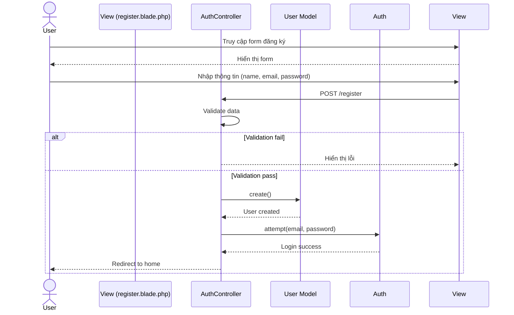
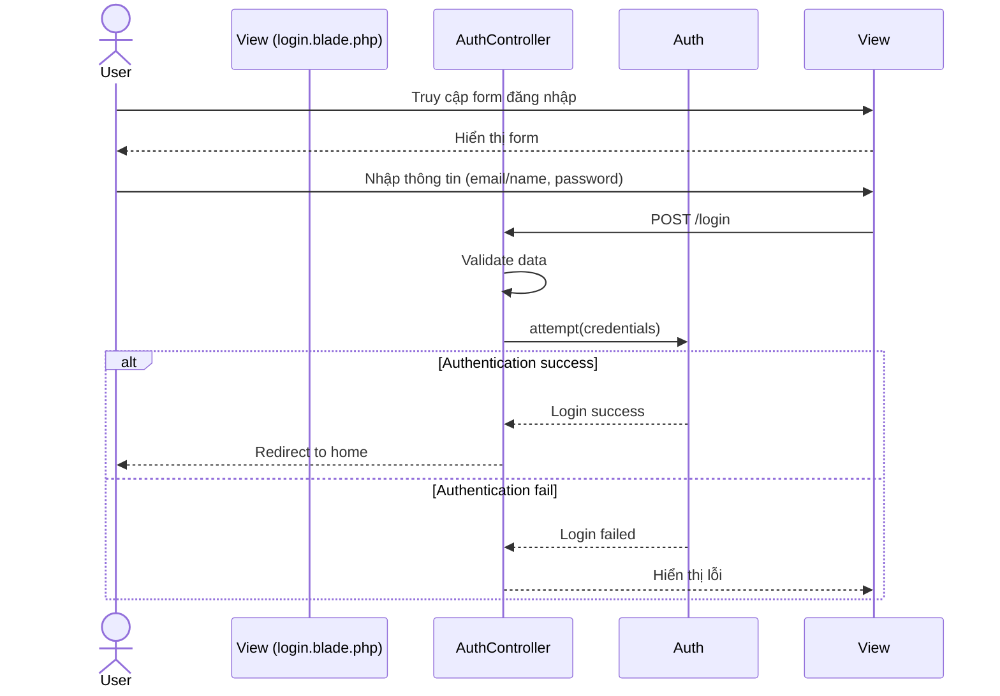

# Sequence Diagram Quản lý Xác thực

## 1. Đăng ký tài khoản


## 2. Đăng nhập


## 3. Đăng xuất
```mermaid
sequenceDiagram
    actor User
    participant View
    participant AuthController
    participant Auth
    participant Session

    User->>View: Click nút đăng xuất
    View->>AuthController: POST /logout
    AuthController->>Auth: logout()
    AuthController->>Session: invalidate()
    AuthController->>Session: regenerateToken()
    AuthController-->>User: Redirect to home