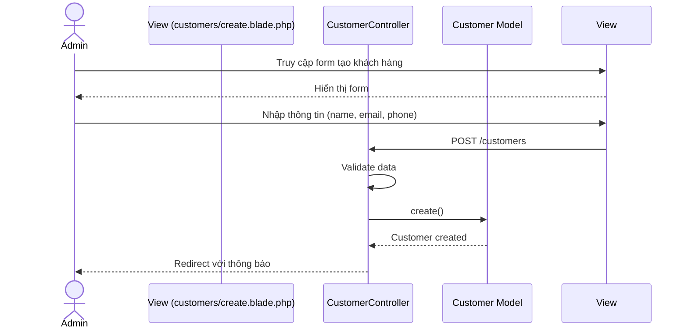
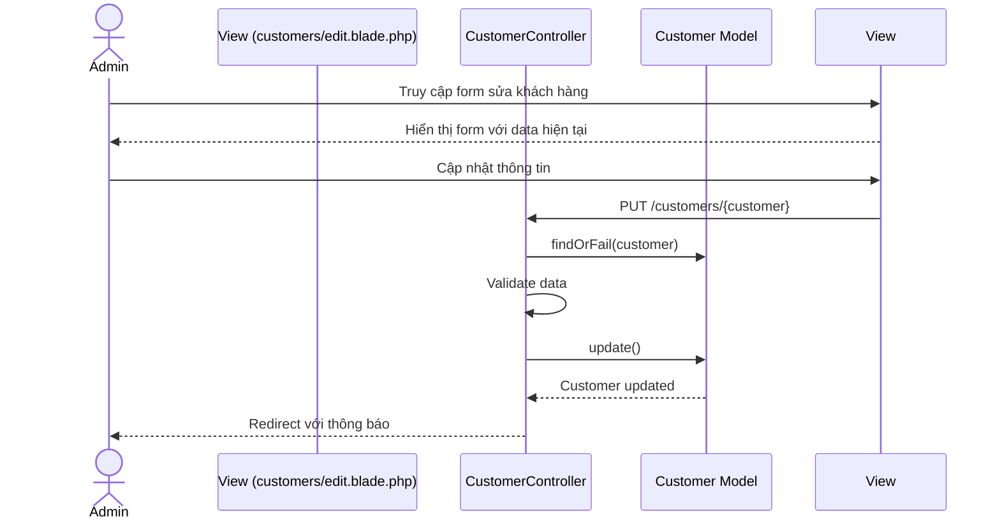
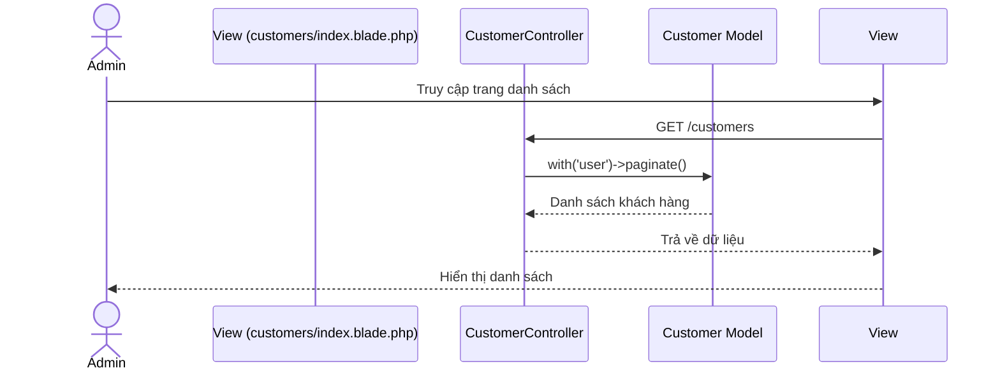

# Sequence Diagram Quản lý Khách hàng

## 1. Tạo mới khách hàng


## 2. Cập nhật thông tin khách hàng


## 3. Xem danh sách khách hàng


## 4. Xem lịch sử đơn hàng của khách hàng
```mermaid
sequenceDiagram
    actor Admin
    participant View (customers/orders.blade.php)
    participant CustomerController
    participant Customer Model
    participant Order Model

    Admin->>View: Click "Xem đơn hàng"
    View->>CustomerController: GET /customers/{customer}/orders
    CustomerController->>Customer Model: findOrFail(customer)
    CustomerController->>Order Model: get orders with items
    Order Model-->>CustomerController: Danh sách đơn hàng
    CustomerController-->>View: Trả về dữ liệu
    View-->>Admin: Hiển thị lịch sử đơn hàng