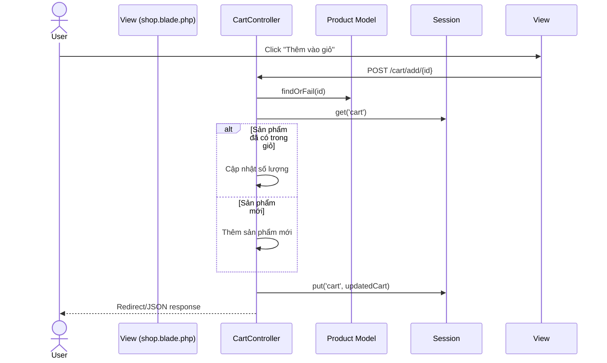
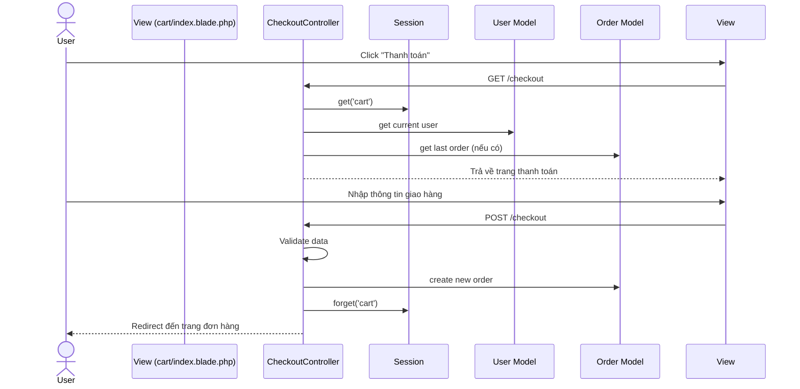

# Sequence Diagram Quy trình Đặt hàng

## 1. Thêm sản phẩm vào giỏ hàng


## 2. Thanh toán


## 3. Xử lý đơn hàng
```mermaid
sequenceDiagram
    actor Admin
    participant View (orders/index.blade.php)
    participant OrderController
    participant Order Model

    Admin->>View: Truy cập trang quản lý đơn hàng
    View->>OrderController: GET /orders
    OrderController->>Order Model: with('customer', 'items.product')
    OrderController-->>View: Trả về danh sách đơn hàng
    Admin->>View: Click "Cập nhật trạng thái"
    View->>OrderController: POST /orders/{id}/update-status
    OrderController->>Order Model: findOrFail(id)
    OrderController->>Order Model: update status
    OrderController-->>Admin: Redirect với thông báo