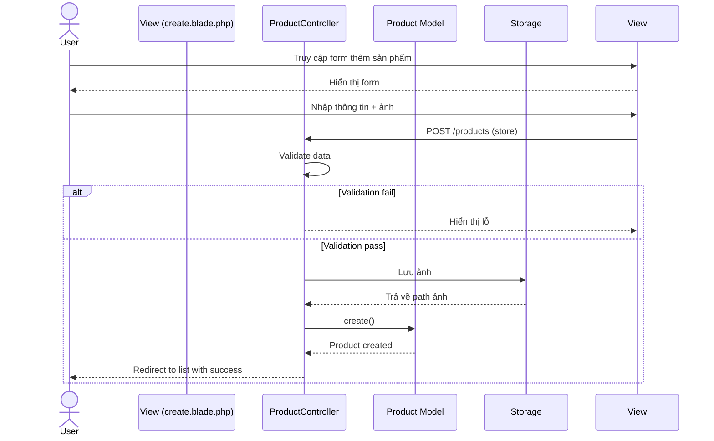
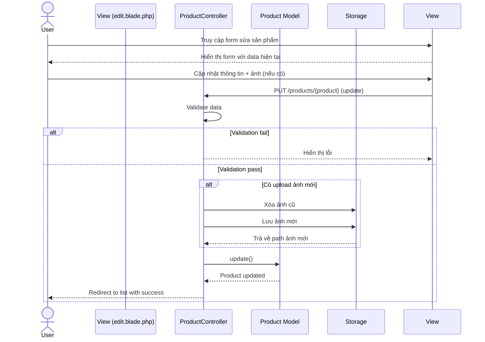
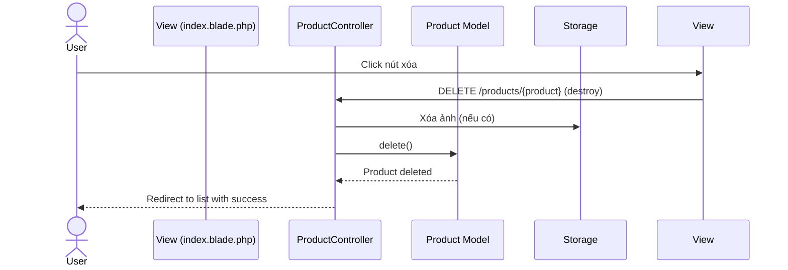

# Sequence Diagram Quản lý Sản phẩm

## 1. Thêm sản phẩm mới


## 2. Cập nhật sản phẩm


## 3. Xóa sản phẩm


## 4. Xem chi tiết sản phẩm
```mermaid
sequenceDiagram
    actor User
    participant View (show.blade.php)
    participant ProductController
    participant Product Model
    participant Review Model

    User->>View: Truy cập trang chi tiết
    View->>ProductController: GET /products/{product} (show)
    ProductController->>Product Model: Find product
    ProductController->>Review Model: Get reviews
    ProductController->>Product Model: Get related products
    Product Model-->>ProductController: Product data
    Review Model-->>ProductController: Reviews data
    ProductController-->>View: Render view with data
    View-->>User: Hiển thị chi tiết sản phẩm