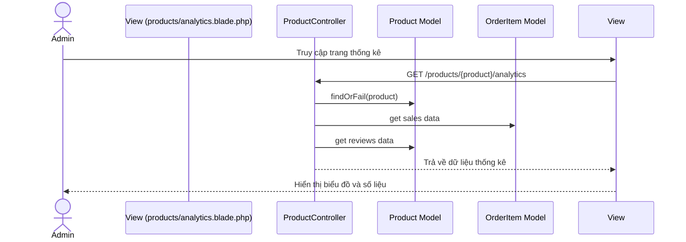
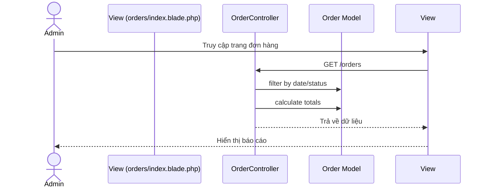
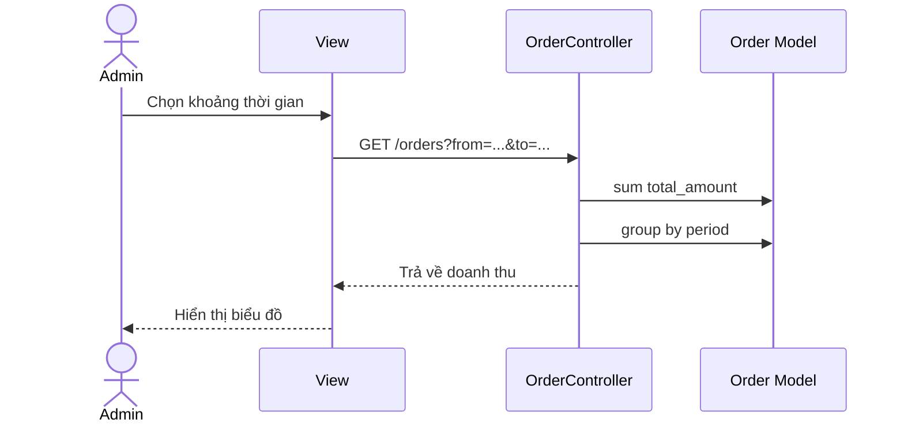

# Sequence Diagram Quy trình Thống kê Báo cáo

## 1. Thống kê sản phẩm


## 2. Thống kê đơn hàng


## 3. Thống kê doanh thu


## 4. Thống kê đánh giá
```mermaid
sequenceDiagram
    actor Admin
    participant View
    participant ProductController
    participant Review Model

    Admin->>View: Truy cập trang đánh giá
    View->>ProductController: GET /products/{product}/analytics
    ProductController->>Review Model: get rating distribution
    ProductController->>Review Model: calculate average
    ProductController-->>View: Trả về dữ liệu
    View-->>Admin: Hiển thị phân bố đánh giá