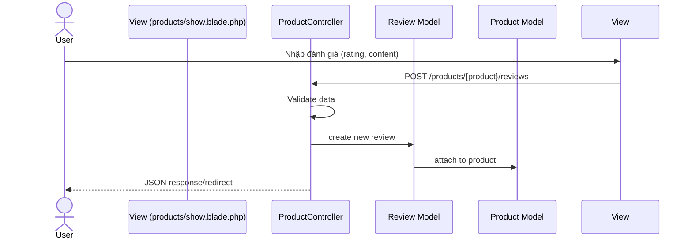
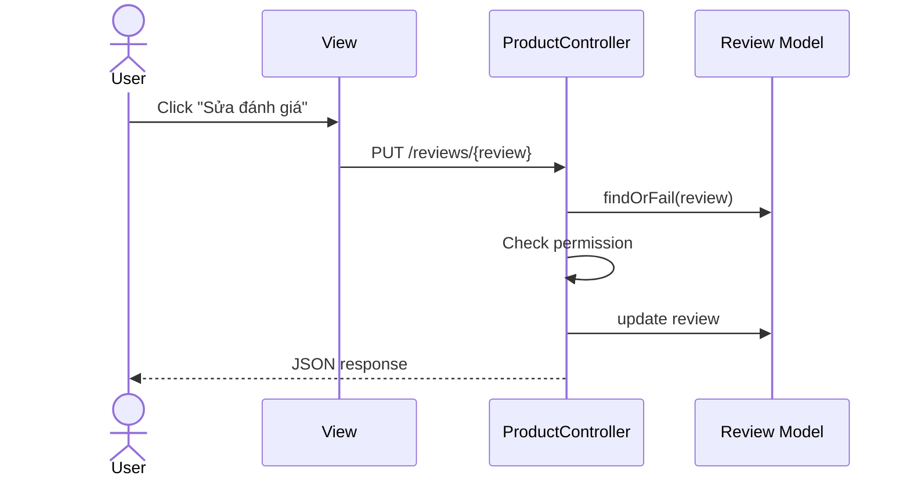
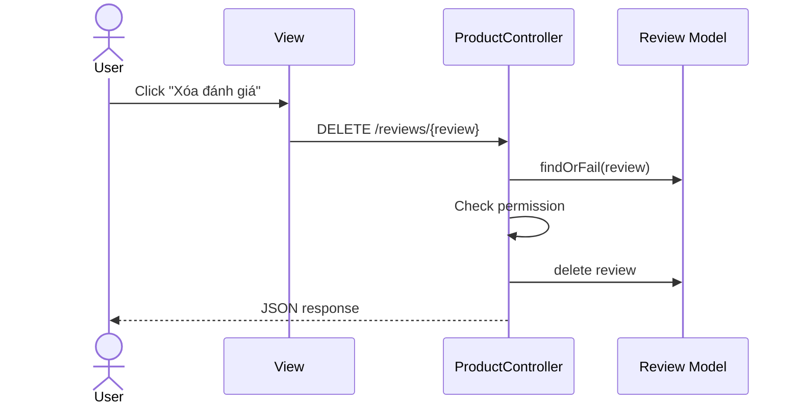

# Sequence Diagram Quy trình Đánh giá Sản phẩm

## 1. Thêm đánh giá


## 2. Cập nhật đánh giá


## 3. Xóa đánh giá


## 4. Hiển thị đánh giá
```mermaid
sequenceDiagram
    actor User
    participant View (products/show.blade.php)
    participant ProductController
    participant Product Model
    participant Review Model

    User->>View: Truy cập trang chi tiết sản phẩm
    View->>ProductController: GET /products/{product}
    ProductController->>Product Model: findOrFail(product)
    ProductController->>Review Model: get reviews for product
    ProductController-->>View: Trả về dữ liệu
    View-->>User: Hiển thị danh sách đánh giá